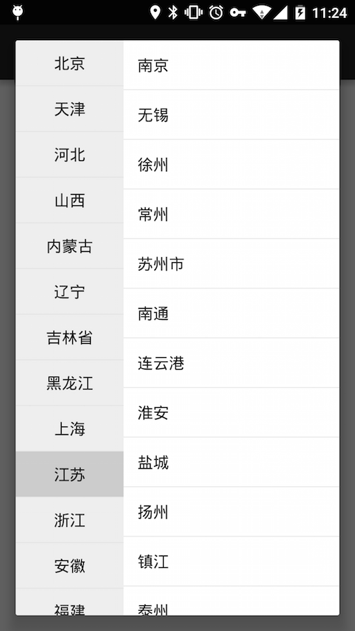

# MultiColumnPicker

<a href='https://bintray.com/twiceyuan/maven/MultiColumnPicker/view?source=watch' alt='Get automatic notifications about new "MultiColumnPicker" versions'></a>


[  ](https://bintray.com/twiceyuan/maven/MultiColumnPicker/_latestVersion)
[ ](http://www.wtfpl.net/txt/copying/)


a simple multiple column picker by dialog

Screenshot
===



Sample
===

```Java
MultiColumnPicker<City, City> picker = new MultiColumnPicker<>(this); // instantiation
picker.setLeftContent(left()); // setup left content
picker.setOnLeftSelected((position, city) -> right(city)); // left selected listener
picker.setOnRightSelected((position, city) -> action(city)); // right selected listener
picker.setMapLeftString(city -> city.name); // map city to city's name
picker.setMapRightString(city -> city.name);
picker.setMapLeftId(city -> city.id); // map city to city's id
picker.setMapRightId(city -> city.id);
picker.setLeftDefault("江苏"); // set default value (left)
picker.show(); // display
```

Usage
===

Module Gradle File

```Groovy
dependencies {
    //...
    compile 'com.twiceyuan.multicolumnpicker:library:1.0.2'
}
```

License
===

               DO WHAT THE FUCK YOU WANT TO PUBLIC LICENSE
                       Version 2, December 2004

    Copyright (C) 2004 Sam Hocevar <sam@hocevar.net>

    Everyone is permitted to copy and distribute verbatim or modified
    copies of this license document, and changing it is allowed as long
    as the name is changed.

               DO WHAT THE FUCK YOU WANT TO PUBLIC LICENSE
      TERMS AND CONDITIONS FOR COPYING, DISTRIBUTION AND MODIFICATION

     0. You just DO WHAT THE FUCK YOU WANT TO.
